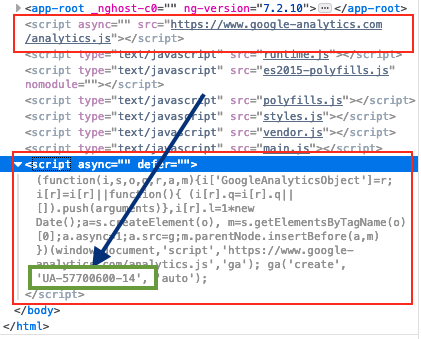

# Mugan86 Angular Google Analytics Library

## ENGLISH 🇬🇧

## What is Google Analytics?

 It is a tool that offers grouped information of the traffic that arrives at the websites according to the audience, the acquisition, the behavior and the conversions that are carried out on the website.

## Objective of the library

The objective of this library is to make available to users an implementation to configure the Analytics section easily in an Angular application.

## Instructions to use library

### Create a tracking property in Google Analytics

https://support.google.com/analytics/answer/1042508

### Find the tracking ID: 

https://support.google.com/analytics/answer/1008080?hl=en&visit_id=636886970225453334-570640806&rd=1#trackingID

### Add Module in Application Module

Add in imports "Mugan86GoogleAnalyticsModule" and initialize with Tracking ID. Add show log optionally to show input tracking ID

```
@NgModule({
  declarations: [
    AppComponent,
    OneComponent,
    TwoComponent
  ],
  imports: [
    BrowserModule,
    RouterModule.forRoot(appRoutes),
    Mugan86GoogleAnalyticsModule.forRoot(
      {
        analyticsId: 'UA-57700600-14',
        showLog: true
      }
    )
  ],
  providers: [],
  bootstrap: [AppComponent]
})
export class AppModule { }
```

### Add analytics component in app-root component template

For example, in app.component.html
```
<mga-google-analytics></mga-google-analytics>
```

### Check in Browser Console if script Google Analytics correct load



## ESPAÑOL 🇪🇸

## What is Google Analytics?

Es una herramienta que ofrece información agrupada del tráfico que llega a los sitios web según la audiencia, la adquisición, el comportamiento y las conversiones que se llevan a cabo en el sitio web.

## Objective of the library

El objetivo de esta biblioteca es poner a disposición de los usuarios una implementación para configurar fácilmente la sección de Google Analytics en una aplicación Angular.

## Instrucciones de uso de la librería

* Crear una propiedad de segumiento en Google Analytics: https://support.google.com/analytics/answer/1042508
* Encontrar el ID del segumiento: https://support.google.com/analytics/answer/1008080?hl=es-419&visit_id=636886970225453334-570640806&rd=1#trackingID