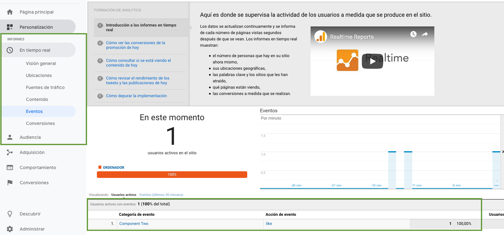

# Mugan86 Angular Google Analytics Library

## ENGLISH 🇬🇧 

Library to add Google Analytics in our applications of Angular

## What is Google Analytics?

 It is a tool that offers grouped information of the traffic that arrives at the websites according to the audience, the acquisition, the behavior and the conversions that are carried out on the website.

## Objective of the library

The objective of this library is to make available to users an implementation to configure the Analytics section easily in an Angular application.

## Instructions to use library

### Create a tracking property in Google Analytics

https://support.google.com/analytics/answer/1042508

### Find the tracking ID: 

https://support.google.com/analytics/answer/1008080?hl=en&visit_id=636886970225453334-570640806&rd=1#trackingID

### Add the module in the module where it will be used

Add in **imports** "Mugan86GoogleAnalyticsModule" and initialize with Tracking ID. Add show log optionally to show input tracking ID

```
@NgModule({
  declarations: [
    AppComponent,
    OneComponent,
    TwoComponent
  ],
  imports: [
    BrowserModule,
    RouterModule.forRoot(appRoutes),
    Mugan86GoogleAnalyticsModule.forRoot(
      {
        analyticsId: 'UA-57700600-14',
        showLog: true
      }
    )
  ],
  providers: [],
  bootstrap: [AppComponent]
})
export class AppModule { }
```

### Add analytics component in app-root component template

For example, in app.component.html
```
<mga-google-analytics></mga-google-analytics>
```

### Check in Browser Console if script Google Analytics correct load


### Tracking ID Code is working Check

To verify that the tracking code works, visit your website and check if the visit is recorded in the **"In real time"** reports.


### Add events to register any action

To register random action, we need add a component to register event

**one.component.ts**
```
import { Component } from '@angular/core';
import { GoogleAnalyticsService } from 'mugan86-google-analytics';

@Component({
  selector: 'app-one',
  templateUrl: './one.component.html',
  styleUrls: ['./one.component.css']
})
export class OneComponent {

  constructor(public googleAnalyticsService: GoogleAnalyticsService) { }

  sendLikeEvent() {
    // We call the event emmiter function from our service and pass in the details
    this.googleAnalyticsService.eventEmitter('userPage', 'Follow User', 'userLabel', 1);
  }

}
```

**one.component.html**
```
<button (click)="sendLikeEvent()">
  Like
</button>
```

### Events results in Google Analytics


## ESPAÑOL 🇪🇸 

Librería para añadir Google Analytics en nuestras aplicaciones de Angular

## ¿Qué es Google Analytics?

Es una herramienta que ofrece información agrupada del tráfico que llega a los sitios web según la audiencia, la adquisición, el comportamiento y las conversiones que se llevan a cabo en el sitio web.

## Objetivo de la librería

El objetivo de esta biblioteca es poner a disposición de los usuarios una implementación para configurar fácilmente la sección de Google Analytics en una aplicación Angular.

## Instrucciones de uso de la librería

### Crear la propiedad de segumiento en Google Analytics

https://support.google.com/analytics/answer/1042508

### Buscar el ID de seguimiento: 

https://support.google.com/analytics/answer/1008080?hl=en&visit_id=636886970225453334-570640806&rd=1#trackingID

### Añadir el módulo en el módulo donde se usará

Añadir en la propiedad **imports** "Mugan86GoogleAnalyticsModule" e inicializar con la propiedad. La propiedad para mostrar el ID de seguimiento es opcional.

```
@NgModule({
  declarations: [
    AppComponent,
    OneComponent,
    TwoComponent
  ],
  imports: [
    BrowserModule,
    RouterModule.forRoot(appRoutes),
    Mugan86GoogleAnalyticsModule.forRoot(
      {
        analyticsId: 'UA-57700600-14',
        showLog: true
      }
    )
  ],
  providers: [],
  bootstrap: [AppComponent]
})
export class AppModule { }
```

### Añadir Analytics en el componente inicial de la aplicación

Por ejemplo, en app.component.html
```
<mga-google-analytics></mga-google-analytics>
```

### Comprobar en la consola del navegador si tenemos correctamente cargado el script


### Verificar que el código de seguimiento funciona

Para verificar que el código de seguimiento funciona, visite su sitio web y compruebe si la visita se registra en los informes **"En tiempo real"**.


### Añadir eventos con cualquier acción

Para registrar una acción (evento) aleatoria, necesitamos un componente para registrar el evento deseado

**one.component.ts**
```
import { Component } from '@angular/core';
import { GoogleAnalyticsService } from 'mugan86-google-analytics';

@Component({
  selector: 'app-one',
  templateUrl: './one.component.html',
  styleUrls: ['./one.component.css']
})
export class OneComponent {

  constructor(public googleAnalyticsService: GoogleAnalyticsService) { }

  sendLikeEvent() {
    // We call the event emmiter function from our service and pass in the details
    this.googleAnalyticsService.eventEmitter('userPage', 'Follow User', 'userLabel', 1);
  }

}
```

**one.component.html**
```
<button (click)="sendLikeEvent()">
  Like
</button>
```

### Resultados de los eventos en Google Analytics



## Authors

* **Anartz Mugika Ledo** - *Initial work* - [mugan86](https://github.com/mugan86)

See also the list of [contributors](https://github.com/your/project/contributors) who participated in this project.

## License

This project is licensed under the MIT License - see the [LICENSE.md](./../../LICENSE.md) file for details

